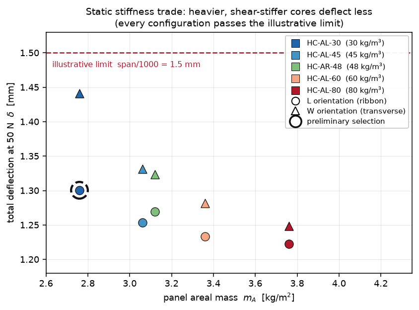
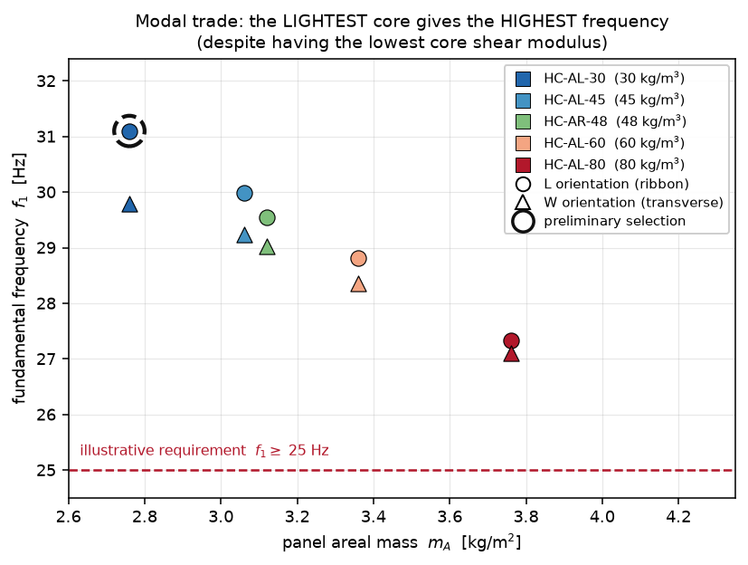
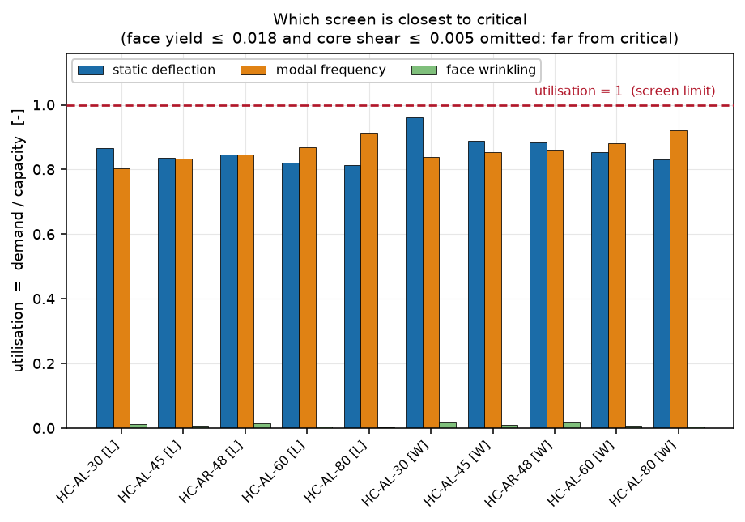
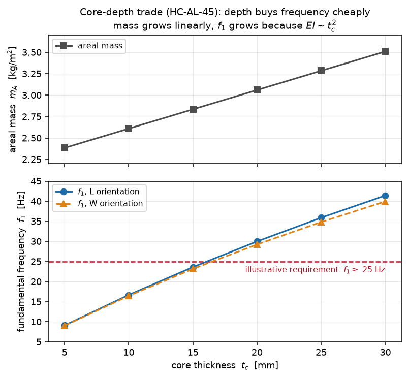

# Honeycomb Core Selection for a Sandwich Solar-Panel Substrate

**STM-10** — a preliminary structural screening study for the honeycomb core of a
spacecraft solar-panel substrate, built as a verified, reproducible Python model.

> ⚠️ **All candidate properties in this portfolio study are illustrative
> engineering inputs, not manufacturer allowables.** Both screening thresholds are
> illustrative too. Nothing here is a flight-qualified core selection.

---

## Objective

> How do honeycomb-core density and directional stiffness affect sandwich-panel
> mass, static deflection, local failure margins, and fundamental frequency — and
> which illustrative candidate is the best preliminary choice within this
> simplified design space?

The study builds a symmetric sandwich beam strip from first principles, screens
five candidate cores in two orientations against four independent requirement
families, and applies a deterministic selection policy to whatever survives.

## Key result

**Illustrative preliminary selection: `HC-AL-30 [L]`** — the lightest candidate,
oriented with the beam strip along the core ribbon direction.

| quantity | value | screen |
| --- | ---: | :--- |
| core density | 30 kg/m³ | — |
| panel areal mass | **2.760 kg/m²** | minimised |
| total strip mass | 2.070 kg | — |
| total deflection at 50 N | 1.300 mm | **PASS** (limit 1.5 mm) |
| fundamental frequency `f₁` | **31.10 Hz** | **PASS** (limit 25 Hz) |
| face yield margin | +56.6 | PASS |
| core shear margin | +359 | PASS |
| wrinkling margin | +78.9 | PASS |
| core crushing margin (local patch) | +6.5 | PASS |
| **closest screen** | static deflection | utilisation 0.867 |

**Selection basis:** *minimum areal mass among configurations passing all
preliminary screens*, with ties broken by frequency margin, then database order.

All ten candidate-direction configurations pass every screen, so the selection is
driven by the minimum-mass rule — but the lightest core is *also* the
highest-frequency one, so mass and dynamics agree rather than trading off.

## Engineering workflow

```
sandwich beam-strip mechanics
  → exact face-sheet section properties (parallel-axis, no thin-face shortcut)
  → bending + core-shear deflection
  → orthotropic L/W core stiffness trade
  → face yield + directional core shear strength
  → local core compression + face wrinkling screen
  → first-order sandwich modal screening
  → illustrative preliminary core selection
```

Each stage is additive: every earlier result is preserved bit-for-bit and
re-verified by the later layers' tests.

## Sandwich-panel formulation

Symmetric three-layer strip, `z = 0` at the mid-plane, simply supported over span
`L`, SI units throughout.

**Geometry** `h = 2·t_f + t_c`, face centroid offset `z_f = t_c/2 + t_f/2`.
The neutral axis is *computed* from a modulus-weighted first moment, not assumed —
it evaluates to exactly `z = 0` for the symmetric layup.

**Section** — exact parallel-axis, never the thin-face approximation:

```
I_face  = b·t_f³/12 + (b·t_f)·z_f²          I_faces = 2·I_face
EI      = E_f · I_faces
```

The thin-face approximation is computed alongside for comparison only (it
under-predicts by 0.0128 % here). **Core normal-stress bending stiffness is
neglected** — the core carries transverse shear only.

**Mass** `m_A = 2·ρ_f·t_f + ρ_c·t_c`, `μ = m_A·b` (bare faces + core; no cells,
adhesive, harness or mechanisms).

**Static response** — simply supported strip, central point load `P`:

```
M_max = P·L/4            V_max = P/2
δ_b   = P·L³/(48·EI)     δ_s = P·L/(4·κ·G_eff·A_s),  A_s = b·t_c
σ_face,max = M_max·(h/2)/I_faces       τ_core = V_max/(b·t_c)
```

`κ = 1.0` is exposed explicitly, never applied silently — `G_eff` is already an
effective sandwich-core shear modulus. `τ_core` is an **average** effective core
shear stress, not a cell-wall stress.

### Canonical panel

`L = 1.5 m`, `b = 0.5 m`, `t_f = 0.4 mm`, `t_c = 20 mm`, `h = 20.8 mm`;
face `E_f = 70 GPa`, `ρ_f = 2700 kg/m³`; global load `P = 50 N`.
`EI = 2913.49 N·m²` — identical for every candidate, because the faces carry it.

## Candidate core representation

Real honeycomb is strongly orthotropic in transverse shear, so the core carries
**two** distinct moduli and the panel orientation is an explicit, validated design
variable. L and W are **never averaged**.

- **L** — ribbon / longitudinal direction, the *stiffer* shear direction
- **W** — transverse / expansion direction, the *softer* one

| candidate | family | `ρ_c` [kg/m³] | `G_L` [MPa] | `G_W` [MPa] | `τ_L` [MPa] | `τ_W` [MPa] | `E_c` [MPa] | `σ_c` [MPa] |
| --- | --- | ---: | ---: | ---: | ---: | ---: | ---: | ---: |
| HC-AL-30 | aluminium-equiv. | 30 | 20 | 8 | 0.90 | 0.55 | 300 | 1.20 |
| HC-AL-45 | aluminium-equiv. | 45 | 40 | 15 | 1.60 | 0.95 | 700 | 2.40 |
| HC-AR-48 | aramid-paper-equiv. | 48 | 30 | 16 | 1.20 | 0.70 | **130** | 2.00 |
| HC-AL-60 | aluminium-equiv. | 60 | 70 | 25 | 2.40 | 1.40 | 1200 | 4.00 |
| HC-AL-80 | aluminium-equiv. | 80 | 120 | 45 | 3.60 | 2.10 | 2000 | 6.50 |

Two families deliberately, so the trade is not one monotonic sweep. The
aramid-equivalent entry has a much lower compression modulus than an
aluminium-equivalent of similar density — which turns out to matter for wrinkling.

Every record carries a machine-readable `source_note` marking it illustrative, and
tests assert that provenance is present on all of them. No manufacturer name or
alloy designation appears anywhere in the database.

## Static stiffness trade



Areal mass spans **2.760 – 3.760 kg/m²**; total deflection spans **1.222 – 1.300 mm**
in L and **1.248 – 1.441 mm** in W. All ten configurations pass the illustrative
`span/1000 = 1.5 mm` limit.

Because the core carries no bending normal stiffness, `EI` and the bending
deflection are *identical* across candidates. Only two things move: areal mass
(through `ρ_c·t_c`) and shear deflection (through `G_eff`). For the same geometry
and load the identity `δ_s,W / δ_s,L = G_L/G_W` holds exactly.

## Strength screening

Two checks, and only two, because only two are supported by beam-strip mechanics:
face longitudinal normal stress and average core shear stress. Both use
`MS = allowable/demand − 1`, with `MS ≥ 0` passing.

At 50 N the demands are `σ_face = 4.685 MPa` and `τ_core = 2.5 kPa`, giving
**face margin +56.6 for every candidate** and core shear margins of +219 to +1439.

Preliminary central-point-load limits: `P_face = 2881 N`, `P_core = 11–72 kN`,
`P_deflection = 52–61 N`. **Deflection governs all ten configurations** — the panel
is stiffness-critical, not strength-critical, by a factor of 48× to 1200×.

## Local sandwich-failure screening

Two more modes, with two deliberately deferred.

**Face wrinkling** — `σ_wr = C_wr·(E_f·E_c·G_eff)^(1/3)`, demand taken as the
existing beam-theory face stress. `C_wr` is a **required explicit input**;
`WrinklingModel()` raises rather than supplying a default, so no empirical constant
hides in the package. Screening stresses span 263–1281 MPa.

**Local core crushing** — an *independent* patch load case (100 N over 25 × 25 mm
= 160 kPa), never combined with the global load. Crush limits 750–4062 N.

**Local indentation is deferred, not implemented.** With the current inputs a
distinct indentation margin would either be the identical equation against the
identical allowable, or require a face plate rigidity, a contact model and an
unsourced characteristic length. `LocalFailureAssessment` exposes no indentation
field, and a test asserts that. **Shear crimping and global buckling are deferred**
because the model has no in-plane compressive load case — the load case is missing,
not the data.

One sandwich-specific mode reordering emerges: for **HC-AR-48 [W]** the wrinkling
limit (2807 N) falls *below* the face-yield limit (2881 N) — the face buckles
locally before it yields, driven by aramid's low compression modulus through the
`E_c^(1/3)` term. Neither mode governs the canonical panel.

## Modal screening

Uniform simply-supported strip, one transverse bending plane, self-mass only.

```
k_n = n·π/L
Euler-Bernoulli:   ω_n = k_n²·√(EI/μ)
shear-corrected:   ω_n² = EI·k_n⁴ / [ μ·(1 + EI·k_n²/(κ·G_eff·A_s)) ]
f_n = ω_n/(2π)
```

The correction was **audited before anything was built on it**. It is not an
arbitrary import: for a static sinusoidal load on the same strip,
`w_shear/w_bending = EI·k²/(κ·G_eff·A_s)` — *exactly* the correction term. The
formula is therefore `ω² = (1/total compliance)/μ`, the same bending-plus-shear
compliance the static model already uses, expressed modally. Dimensions check out,
and all four limits (`G→∞` recovers Euler-Bernoulli from below, `G→0` and `EI→0`
give zero, `μ↑` gives `1/√μ`) are verified by test. Rotary inertia is neglected, so
only mode 1 is used as a screen.



`f₁` spans **27.34 – 31.10 Hz** in L and **27.10 – 29.79 Hz** in W, against an
illustrative **25 Hz** minimum — all ten pass. The bending-only frequency is
bit-for-bit identical between L and W; only the shear correction differs.

## Integrated candidate trade

Four requirement families in four different units, combined **only** by logical
AND. The deflection margin is a length, the strength and local margins are
dimensionless, the frequency margin is a frequency — they are never numerically
combined, and a test asserts no blended-margin attribute exists.

For cross-mode comparison the model reports dimensionless **utilisations**
(`demand/capacity`, so `≤ 1` passes):



| configuration | deflection | face yield | core shear | wrinkling | modal | closest |
| --- | ---: | ---: | ---: | ---: | ---: | :--- |
| HC-AL-30 [L] | **0.867** | 0.017 | 0.003 | 0.013 | 0.804 | deflection |
| HC-AL-45 [L] | 0.836 | 0.017 | 0.002 | 0.008 | 0.834 | deflection |
| HC-AR-48 [L] | 0.846 | 0.017 | 0.002 | 0.014 | 0.846 | deflection |
| HC-AL-60 [L] | 0.822 | 0.017 | 0.001 | 0.005 | **0.868** | frequency |
| HC-AL-80 [L] | 0.815 | 0.017 | 0.001 | 0.004 | **0.915** | frequency |
| HC-AL-30 [W] | **0.961** | 0.017 | 0.005 | 0.017 | 0.839 | deflection |
| HC-AL-45 [W] | 0.888 | 0.017 | 0.003 | 0.010 | 0.855 | deflection |
| HC-AR-48 [W] | 0.883 | 0.017 | 0.004 | 0.018 | 0.861 | deflection |
| HC-AL-60 [W] | 0.854 | 0.017 | 0.002 | 0.007 | **0.882** | frequency |
| HC-AL-80 [W] | 0.832 | 0.017 | 0.001 | 0.005 | **0.923** | frequency |

The local patch utilisation (0.13 for every candidate) belongs to an independent
load case and is reported separately, never mixed into this comparison.

For the two heaviest cores the **frequency** screen is closest to critical — the
only screen other than deflection ever to become critical in this study.

## Preliminary core selection

Deterministic policy, stated once and applied without judgement:

1. must pass **all four** screens
2. among those, **minimise panel areal mass**
3. tie-break: larger frequency margin
4. final tie-break: candidate database order, then L before W

Result: **`HC-AL-30 [L]`**, 2.760 kg/m², `f₁ = 31.10 Hz` (+6.10 Hz margin),
`δ = 1.300 mm`, closest screen `deflection` at utilisation 0.867.

## Sensitivity and robustness

Both thresholds are placeholders, so their influence is measured, not assumed.

| `f₁` requirement | feasible | selected | | deflection limit | feasible | selected |
| ---: | :--- | :--- | --- | :--- | :--- | :--- |
| 20 Hz | 10/10 | HC-AL-30 [L] | | span/500 (3.00 mm) | 10/10 | HC-AL-30 [L] |
| 25 Hz | 10/10 | HC-AL-30 [L] | | span/750 (2.00 mm) | 10/10 | HC-AL-30 [L] |
| 28 Hz | 8/10 | HC-AL-30 [L] | | span/1000 (1.50 mm) | 10/10 | HC-AL-30 [L] |
| 30 Hz | 1/10 | HC-AL-30 [L] | | span/1250 (1.20 mm) | **0/10** | — none — |
| 32 Hz | 0/10 | — none — | | span/1500 (1.00 mm) | 0/10 | — none — |

Two findings:

1. **The selection is completely stable** — the same configuration wins at every
   threshold where anything is feasible. It is not an artefact of the placeholders.
2. **The static screen is brittle** — 10/10 feasible at span/1000, 0/10 at
   span/1250. The placeholder limit decides whether a design exists at all.

The wrinkling result is also coefficient-sensitive: at `C_wr = 0.4` three
configurations show wrinkling below face yield, at 0.5 one does, and at `C_wr ≥ 0.6`
none do. **The mode reordering is real physics; its numerical threshold is not
trustworthy** on an unsourced coefficient.



Core depth is the single strongest lever: over `t_c` = 5 → 30 mm, `EI` rises 32×
and `f₁` rises 9.1 → 41.4 Hz, while areal mass rises only 2.39 → 3.51 kg/m².
Nothing thinner than 20 mm passes at this span. Core thickness is **not** optimised
here — it is a design input, and the trade is shown rather than solved.

## Verification

**740 automated tests, all passing.** Expected values are written as independent
arithmetic — literal formulas or hand-computed constants — never by calling the
helper under test.

| area | what is verified |
| --- | --- |
| Section | symmetric neutral axis computed to exactly zero; exact parallel-axis face inertia; thin-face approximation compared, never substituted; hand `EI` |
| Mass | hand areal mass; face/core decomposition; exact density and width scaling |
| Static | `M_max`, `V_max`, bending/shear deflection decomposition, face stress, core shear stress — all by hand; linearity in `P` |
| Directional | `δ_s,W/δ_s,L = G_L/G_W`; `P_core,L/P_core,W = τ_L/τ_W`; `σ_wr,L/σ_wr,W = (G_L/G_W)^(1/3)`; bending-only `f₁` identical in L and W |
| Strength | margin hand calcs, exact-boundary PASS, fail cases, governing mode computed not hard-coded; allowable-load round trips (zero margin at the returned load, 0.1 % either side) |
| Local | patch pressure `∝ F`, `∝ 1/A`, `∝ 1/side²`; compression boundary; crush-force limit; wrinkling dimensional and cube-root scaling in each modulus |
| Databases | three databases aligned one-to-one, unique names, deterministic order, all values positive and finite, provenance present |
| Modal | dimensional audit; correction term equals the static shear/bending compliance ratio; high-`G` limit approached from below; `G→0` and `EI→0` limits; `n²`, `√EI`, `1/√μ`, `1/L²` scaling |
| Integration | four-way AND logic; each screen fails alone; margins of different units never blended; deterministic selection; requirement-sensitivity monotonicity |
| Regression | every milestone's results reproduce byte-identically through all later layers |

Run `pytest` to reproduce. The test suite executes in under a second.

## Engineering interpretation

**Core-depth leverage.** A lightweight core raises `EI` roughly as `t_c²` through
face separation while adding mass only linearly. This is the dominant design lever
and the reason sandwich construction is used at all.

**Directional behaviour.** The W orientation carries a real shear-flexibility
penalty — up to 11 % more static deflection and 4 % less frequency than L for the
same core. Orientation must be a deliberate decision, never a default.

**Static screening does not discriminate.** Deflection governs everywhere; face
yield and average core shear are two to three orders of magnitude from critical.
A thin, light substrate on a 1.5 m span is stiffness-driven.

**Local modes did not change viability either.** Wrinkling can become more
restrictive than face yield for a low-compression-modulus core in its soft shear
direction, but it still does not govern the canonical panel.

**Modal screening changes the picture** because core density enters the frequency
through distributed mass, whereas it never entered the static bending response —
`EI` is face-dominated and identical across candidates.

**The counterintuitive ranking.** The lightest core gives the *highest* frequency
despite having the *lowest* shear modulus: over this candidate range the mass
penalty of a denser core outweighs its shear-stiffness benefit.
**This ordering is specific to the current geometry, face-sheet design, and
illustrative candidate set** — it is not a general property of sandwich panels.

**Why HC-AL-30 [L] is selected.** Only because it passes all four preliminary
screens and has the lowest areal mass. That it is also the highest-frequency
configuration means the mass rule and the modal screen agree rather than trading
off — which is what makes the choice defensible *within this model*.

**Caveat.** Sourced material data, plate behaviour, hardware masses, joints,
thermal environment and launch dynamics could all reorder this result.

## Limitations

**Model** — simply-supported beam strip; one transverse bending plane; no plate
action; no orthotropic face laminate; core normal-stress bending stiffness
neglected; perfect bonding, no adhesive layer.

**Core data** — entirely illustrative; no manufacturer allowables; no environmental
knockdowns; no temperature or moisture dependence; no manufacturing variability;
no minimum manufacturable density.

**Failure** — face yield only, no plastic redistribution; average core shear with
no cell-wall resolution; simplified uniform-pressure local compression patch;
illustrative wrinkling coefficient; no detailed inserts or potting; no fastener
bearing; no adhesive failure; no local indentation mechanics; no shear crimping;
no global buckling; no damage tolerance; no fatigue.

**Dynamics** — uniform distributed self-mass only; no solar cells, wiring, discrete
hardware, hinges or bus coupling; no damping; no forced response; no
sine/random/shock qualification; no plate, torsional or local modes; no modal
participation; no stress stiffening.

**Design** — deflection requirement illustrative; frequency requirement
illustrative; candidate set illustrative; selection screened, not optimised.

> **The final selection is a preliminary screening result within a simplified
> illustrative design space, not a flight-qualified core choice.**

## Repository structure

```
src/sandwich_panel/
  validation.py            shared positive/finite validators
  materials.py             FaceMaterial, CoreMaterial, OrthotropicCoreMaterial
  directions.py            CoreShearDirection (L / W) convention
  geometry.py  section.py  geometry, neutral axis, second moments, EI
  mass.py      loads.py    areal mass; central-point-load response
  panel.py     sensitivity.py
  core_database.py         illustrative candidate cores
  requirements.py          DeflectionRequirement
  trade.py                 StudyBasis, candidate evaluation, mass/deflection trade
  strength.py              FaceStrength, OrthotropicCoreStrength, margins
  strength_database.py     illustrative strength records
  design_screen.py         strength assessment, preliminary load capacity
  local_failure.py         core compression, patch load, wrinkling model
  local_failure_database.py
  sandwich_screen.py       local failure assessment, capacity with wrinkling
  modal.py                 distributed mass, modal frequencies, FrequencyRequirement
  modal_selection.py       integrated feasibility, utilisations, selection
tests/                     740 tests
examples/                  five milestone scripts + final_honeycomb_core_assessment.py
figures/                   make_figures.py + four portfolio PNGs
```

## Reproduction

```bash
python -m venv .venv && source .venv/bin/activate
pip install -e ".[test,figures]"

pytest                                              # 740 tests
python examples/final_honeycomb_core_assessment.py  # the whole screening chain
python figures/make_figures.py                      # regenerate all four figures
```

Individual milestone scripts:

```bash
python examples/sandwich_panel_sanity.py    # verified mechanics
python examples/core_candidate_trade.py     # mass / stiffness trade
python examples/core_strength_screen.py     # face yield + core shear
python examples/local_failure_screen.py     # wrinkling + crushing
python examples/modal_core_selection.py     # modal screen + selection
```

The package and test suite have **no runtime dependencies**; only figure
generation needs `matplotlib` (the `figures` extra). The test suite and every
script also run without installing — a root `conftest.py` and a path fallback in
each script put `src/` on `sys.path`.

Figure generation is deterministic: repeated runs in the same environment produce
byte-identical PNGs (no timestamp is embedded). The bytes do depend on the
matplotlib/FreeType version, since those rasterize glyphs differently — the
*plotted data* is identical either way. The committed PNGs were generated with
matplotlib 3.11.

## License

Released under the [MIT License](LICENSE).

The licence covers the code, tests and documentation in this repository. It does
**not** convert any of the illustrative material properties or screening
thresholds into engineering data — those remain representative study inputs, not
manufacturer allowables, and carry no warranty or fitness-for-purpose claim of any
kind (see the licence text and the Limitations section above).
